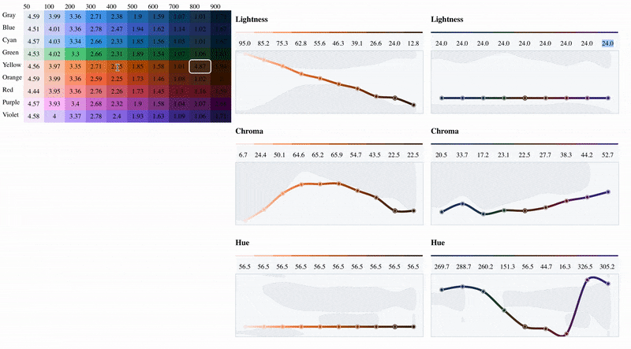

# Color Lab

This is just me trying to learn some React and a bit of color theory by
attempting to build a color-pallette tool introduced in this
[post](https://stripe.com/blog/accessible-color-systems) from Stripe's
blog.

## Running

You should have [yarn
installed](https://classic.yarnpkg.com/en/docs/install/#mac-stable). (`brew
install yarn`)

```
git clone https://github.com/pbardea/lab
cd lab
yarn start
```

## What does it do

It lets you explore colors in CIE Lch(ab) color space, and see which of those
colors is can be represented in the sRGB color space in the hex format that we
all know and love (à la #0FACE1). Stripe used it to find a color pallet that was
vibrant but maintained sufficient contrast to be accessible (see blog post
linked above for more info).

I also find it interesting to play around with the nifty sliders.



